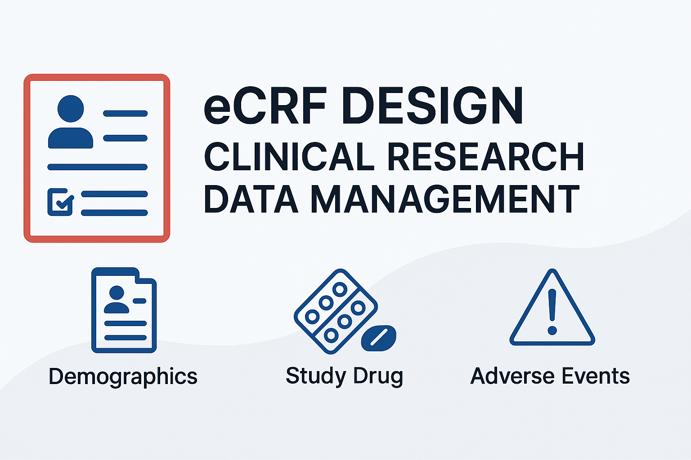
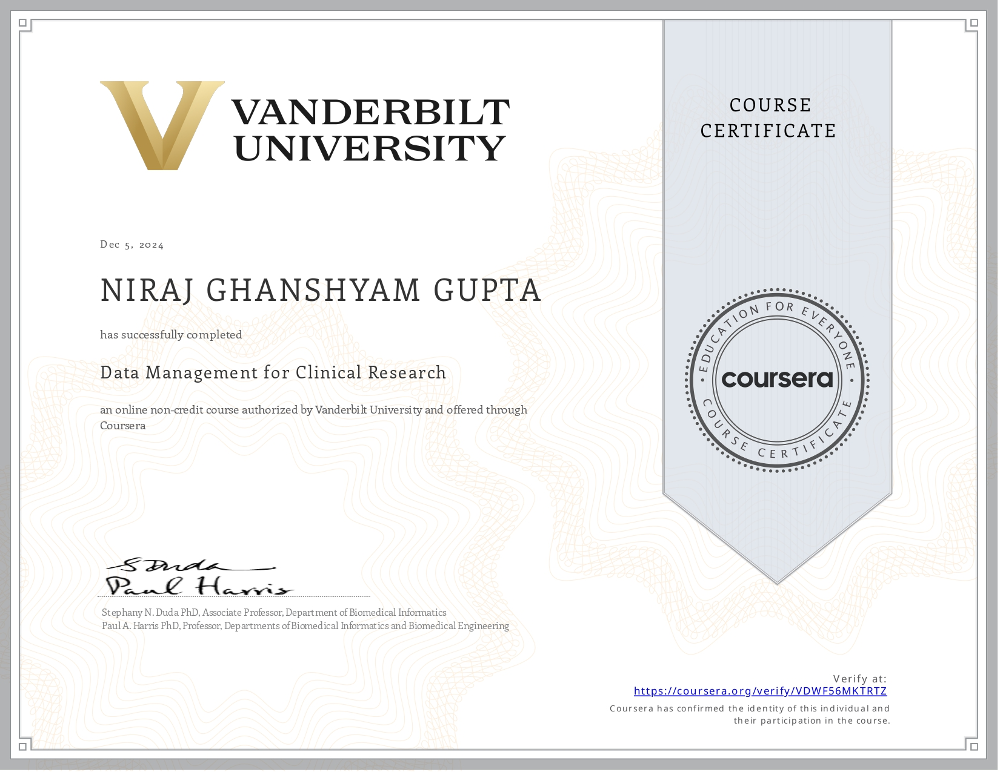

  

# 📄 Case Report Form Design – Clinical Research Data Management

Welcome! This project presents a fully structured and validated **electronic Case Report Form (eCRF)** and **Data Dictionary Codebook**, developed as part of the **[Data Management for Clinical Research](https://www.coursera.org/learn/clinical-data-management)** course by Vanderbilt University on Coursera.

---

## 🧪 What’s Inside?

📁 **Files Included:**

| File Name                                      | Description                                                  |
|-----------------------------------------------|--------------------------------------------------------------|
| `📄 Case report form.pdf`                     | Designed eCRF for clinical trial patient data collection     |
| `📘 Data Dictionary Codebook.pdf`             | Detailed metadata for each eCRF variable                     |
| `🎓 Data Management Certificate.pdf`          | Verified Coursera certificate from Vanderbilt University     |

---

## 🧠 Key Features of the eCRF

✔️ Built on REDCap  
✔️ Follows **21 CFR Part 11** compliance  
✔️ Designed for **Phase 3 Clinical Trial**  
✔️ Includes:

- 🧍 Demographics  
- 🧪 Baseline Vitals  
- 💊 Drug Administration  
- ⚠️ Adverse Events  
- 📈 Lab Results  
- ✅ Final Assessments

---

## 📚 Course Details

- **Course**: *Data Management for Clinical Research*  
- **Institution**: Vanderbilt University  
- **Platform**: Coursera  
- **Completion Certificate**:
## 📜 Certificate of Completion

This project was completed as part of the **Data Management for Clinical Research** course by **Vanderbilt University** on Coursera.

📅 Date: *December 5, 2024*  
🔗 [View Verified Certificate](https://coursera.org/verify/VDWF56MKTRTZ)

---

## 🧰 Tools & Standards Used

- 📊 **REDCap** (Research Electronic Data Capture)  
- 🧬 Clinical Data Standards: Field Types, Logic, and Validation  
- 📁 Documented using PDF with clear variable coding and definitions  
- ✅ Good Clinical Practice (GCP) Compliant

---

## 🙋‍♂️ About Me

I’m a final-year **Bachelor of Pharmacy (B. Pharma)** student passionate about:

- Clinical Data Management  
- Real-World Evidence (RWE)  
- Data Analytics in Healthcare  

📬 **Let’s Connect:**  

---

## ⭐ If you found this helpful, give the repo a star!

